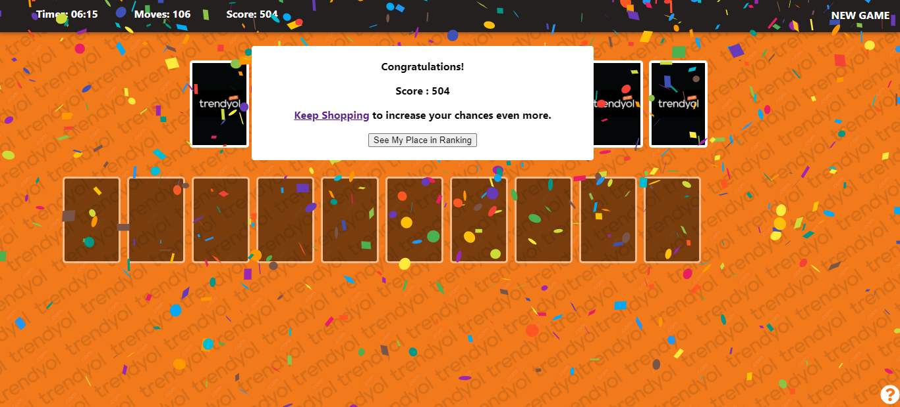

# ♠️ TRENDYOL REVERSED SPIDER SOLITAIRE GAME ♠️

# [Live Demo](https://solitaire-beril-gokce-cicek.herokuapp.com/) 🚀

GSM operators always have applications such as raffles, games etc.(e.g Salla Kazan, Hediye Çarkı), why not such an application in e-commerce sites? For this, I made the Reversed Spider Solitaire game with a Trendyol theme.

 ## Happy Path
 
- The user wins a game coupon for every purchase of 150 TL or more.
- If user finishes the game, the user gets a place on the leaderboard.
- At the end of the month, the user with the highest score wins the surprise gift.
- To get more chances, you can shop again and win one more coupon.

## Project Preview

[Click](https://www.solitairecardgames.com/how-to-play-solitaire) to see the definitions of the areas in the game.

This is start view. You can move the cards with drag and drop.


If you try to drag an unordered pile of cards, you will get a warning.


A set is complete if a pile of cards is lined up from A to K.


If you complete all 8 sets, you can see the confetti 🥂


## Project Setup

### Getting started with
```
git clone https://github.com/gokcecicek/solitaire-beril-gokce-cicek.git
```

### Keep going with

```
npm install
```

### Start with
```
npm start
```

## Built with
- [React](https://reactjs.org)
- [JavaScript](https://developer.mozilla.org/en-US/docs/Web/JavaScript)
- [HTML](https://developer.mozilla.org/en-US/docs/Web/HTML)
- [SCSS](https://sass-lang.com/guide)

PS: You can find the unit test and lighthouse results in the screenshot folder.
